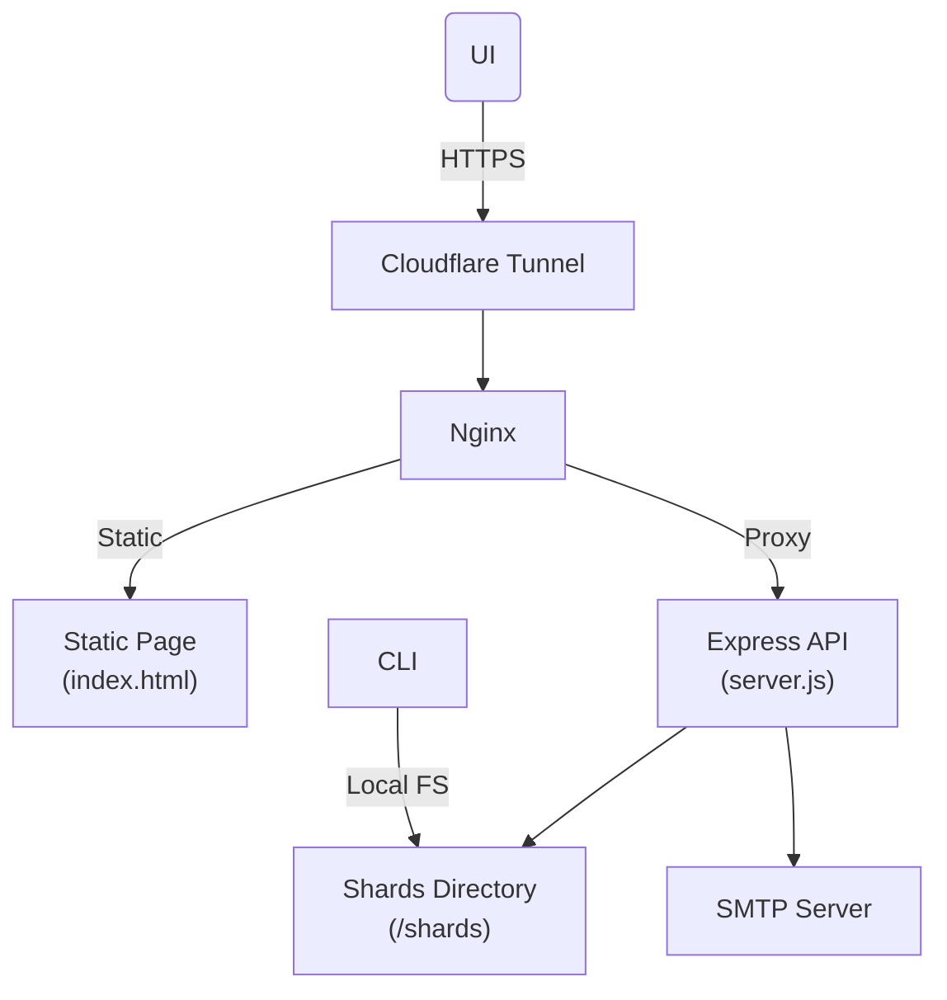

# Breach Lookup Service


This project hosts a secure and privacy-respecting breach lookup service that allows users to check if their email addresses were found in known breach compilations. 
As a proof of concept, this project is published on a Raspberry Pi, backed by JSONL shard storage and served through a lightweight Express web service with email verification.

Password managers sometimes alert the user that an account of theirs has appeared in one or more breaches. This message is often a vague one and doesn't tell the user where it has appeared, or exactly what data  was compromised.
I thought it can be useful if authenticated owners of an an email address can learn exactly what data of theirs was compromised in the past, and this service is created to serve this purpose.

The following measures were taken to ensure privacy:

- When a user requests a lookup for an email address, a 6-digit code is sent to that email to verify ownership of the account. Upon entering the correct code, the user is able to view relevant data concerning their email address.
- The breach data is transformed into json shards. Every entry contained an HMAC-hash value of the email address, in addition to the cleartext email which was needed in the early stages to verify the application is working as intended. After completing the verification, the cleartext email was scrubbed from all shards using ('scrub-emails.js') in the [Breach-Ingestor repo](https://github.com/akram0zaki/breach-ingestor).
- The cleartext email address entered by the user is not persisted in any application or web log files or databases. It lives in memory for a pre-configured number of minutes to be able to do the code validation. I currently have this window set to 10 minutes in the published service.
- To perform the lookup, the cleartext email entered by the user is then converted into an HMAC-hash, which is used for the lookup.

To learn more about thow the data shards are created, please visit the [Breach-Ingestor repo](https://github.com/akram0zaki/breach-ingestor).

I am hosting this project online at [AZ Projects](https://breach-lookup.azprojects.net/) where it relies on Cloudflare Tunnel to channel the traffic to a Raspberry Pi device, and Cloudflare Turnstil for the Captcha challenge. 

The installation instructions below reflect this setup for educational purpose only, to demonstrate how a service can be published with free hosting, TLS certificates, WAF protection, and free captcha challenge, all on low-specs hardware.

It's important to pay attention to security concerns if you plan to host public pages. Place your server in a De-militarized Zone (DMZ) isolated from the rest of your network, continuously harden your OS and software stack, don't store any other sensitive information on the same device or network, and have security monitoring in place.

---

## OWASP Security Controls

To ensure the lookup service is safe and resilient against common attack vectors, multiple protections aligned with the [OWASP Top 10](https://owasp.org/Top10/) were implemented:

| OWASP Threat | Protection Implemented |
|--------------|------------------------|
| A01: Broken Access Control | JWT token required for `/api/breaches`. Only verified users can access data. |
| A02: Cryptographic Failures | All email addresses are hashed using HMAC-SHA256. No plaintext email is persisted. TLS is enforced via Cloudflare Tunnel. |
| A03: Injection | No dynamic SQL or command injection vectors present. Input is sanitized. |
| A04: Insecure Design | CAPTCHA and rate limits mitigate automated abuse. Clear separation between verification and data access. |
| A05: Security Misconfiguration | `helmet` sets secure HTTP headers. Express fingerprint removed. Proper CORS configured. |
| A07: Identification & Auth Failures | Email code verification with expiry + JWT tokens with TTL. |
| A08: Software/Data Integrity Failures | No dynamic eval/imports. Only static dependencies. |
| A09: Logging & Monitoring | `morgan` logs all HTTP access. PM2 captures stdout/stderr for audit. |

These controls ensure the service remains lightweight, verifiable, and secure while hosted on constrained hardware such as a Raspberry Pi.

---

## Architecture



* **Cloudflare Tunnel**: Secures inbound traffic, routes hostnames to your Pi.

* **Nginx**:

  * Serves static UI under `breach-lookup.azprojects.net`
  * Proxies `/api/*` to Express API on port 3000

* **Express API** (`server.js`):

  1. **POST /api/request-code**

     * Validates Cloudflare Turnstile CAPTCHA
     * Generates and emails a 6-digit one-time code

  2. **POST /api/verify-code**

     * Verifies the code, issues a JWT (1h)

  3. **GET /api/breaches**

     * Authenticates JWT
     * Streams the corresponding shard file and filters records

* **Shards**:

  * Directory tree: 256 subfolders `00`–`ff`
  * Files named `<first4hex>.jsonl.gz` or `.jsonl`

* **CLI** (`search.js`): Locally hashes an email, finds and searches the proper shard. Used mainly in the initial stages to verify that the application is working as designed.

---

## Prerequisites

* **Hardware**: This project was hosted on a Raspberry Pi 5, which offers very low resource consumption, making it a good choice for 24x7 hosting
* **Node.js** ≥ 18
* **pm2** for process management
* **cloudflared** for Cloudflare Tunnel
* **A mounted NAS** with the breach data shards
* **SMTP** account (e.g., Zoho)
* **Cloudflare Turnstile** site & secret keys for CAPTCHA

---

## Installation

```bash
git clone https://github.com/akram0zaki/breach-lookup.git
cd breach-lookup
npm install
```

---

## Configuration

Create a `.env` in the project root:

```ini
# Keys & Secrets
EMAIL_HASH_KEY=<hex 32-byte key>
JWT_SECRET=<jwt-secret>

# Shard path
SHARD_DIR=/mnt/data/shards

# Cloudflare Turnstile
TURNSTILE_SECRET=<turnstile-secret>

# SMTP (e.g. Zoho)
SMTP_HOST=smtp.zoho.com
SMTP_PORT=465
SMTP_SECURE=true
SMTP_USER=<user@example.com>
SMTP_PASS=<app-password>
SMTP_FROM="Breach Lookup <user@example.com>"
```

Configure Cloudflare Tunnel at `/etc/cloudflared/config.yml`:

```yaml
tunnel: <UUID>
credentials-file: ~/.cloudflared/<UUID>.json
origincert: ~/.cloudflared/cert.pem

ingress:
  - hostname: breach-lookup.azprojects.net
    service: http://localhost
  - hostname: www.azprojects.net
    service: http://localhost
  - service: http_status:404
```

---

## Running the Service

### Start with PM2

```bash
# Start API + UI
pm2 start ecosystem.config.cjs --only breach-lookup

# Persist on reboot
pm2 save
pm2 startup
```

* **Status**: `pm2 list`
* **Logs**:

  * `~/.pm2/logs/breach-lookup-out.log`
  * `~/.pm2/logs/breach-lookup-error.log`

### Start Tunnel

```bash
systemctl enable --now cloudflared
```

---

## CLI Lookup

```bash
# Ensure .env is present or export vars
npm install dotenv

node search.js user@example.com
```

---

## Troubleshooting

* **400 on /api/request-code**

  * CAPTCHA token missing or invalid → check front-end Turnstile integration

* **502 Bad Gateway**

  * Check PM2 logs for stack trace
  * Ensure no `node-fetch` imports in server.js (use global fetch)

* **UI not loading**

  * Verify `index.html` served by Nginx at the correct vhost
  * Check Nginx config and reload: `nginx -t && systemctl reload nginx`

* **Shards not found**

  * Confirm `SHARD_DIR` correct, permissions allow read
  * Temporary `.jsonl` vs `.jsonl.gz` support

---

## Logs & Monitoring

* **PM2**

  * `pm2 logs breach-lookup`
  * `pm2 status`

* **Cloudflared**

  ```bash
  journalctl -u cloudflared -f
  ```

---

## License

MIT
